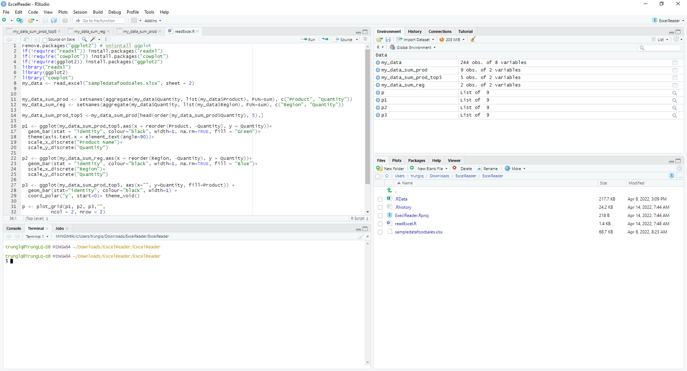
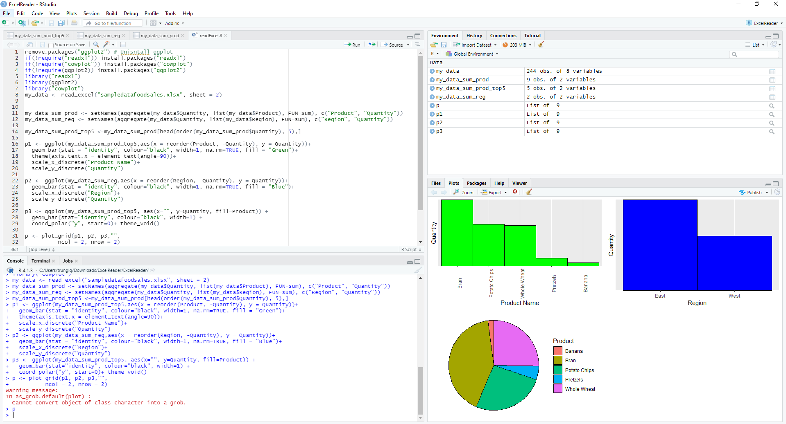

# Sample R Piots

## Cài đặt R:

- Truy cập trang web: https://cran.r-project.org
- Lựa chọn Download R for Windows
- Lựa chọn base
- Download phiên bản mới nhất Download R 4.1.3 for Windows
- Cài đặt R như phần mềm thông thường

## Cài đặt Rstudio:

- Truy cập trang web: https://rstudio.com
- Lựa chọn Product >> Rstudio
- Lựa chọn Rstudio desktop >> Download RStudio Desktop
- Download phiên bản Rstuio mới nhất
- Cài đặt RStudio như phần mềm thông thường

## Mở project bằng RStudio sử dụng file ExeclReader.Rproj

## Mở phần source trong readExcel.R, thực hiện Run để cài các thư viện liên quan

